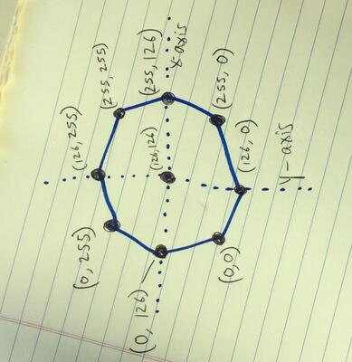

# Wii-chuck Go Kart

This is the ESP8266 microcontroller code for a makeshift go kart propelled by two [PWM][] motors on its left and right side. It allows the user to connect a Wii Nunchuck to accelerate and steer with the stick (and optionally steer with the accelerometer).

[PWM]: https://en.wikipedia.org/wiki/Pulse-width_modulation

# Stick Controls

The ESP8266 uses [I2C][] to communicate with the Nunchuck via the [WiiChuck][] library.

[I2C]: https://en.wikipedia.org/wiki/I2C
[WiiChuck]: https://www.arduino.cc/reference/en/libraries/wiichuck/

**Pushing the stick forwards (y-axis) operates the throttle.** Pulling the stick back does nothing, but would intuntively do reverse if implemented.

**Moving the stick left or right (x-axis) steers** by reducing power on the corresponding wheel, causing the go kart to turn in that direction. As expected, the power reduction is proportional to the amount the stick is moved along the x-axis.

One important thing to note is that the Nunchuck coordinate system is actually a square despite the physical range of motion being an octagon. The practical implication of this is the front two edges of the octagon are full throttle, but also anywhere within the full turning range. At the top-left and top-right corners (x-axis min and max respectively), one wheel will be full power and the other wheel will be zero power, resulting in very sharp turns. Be careful!

# Motion Controls

Managing both throttle and steering on the same little input might be tricky, so it's possible to dedicate the stick entirely to throttle by moving steering to motion controls.

**To activate motion steering, continuously hold down the Z button and roll the Nunchuck left or right.** When the button is released, steering will return to the stick x-axis.

Motion steering depends on the Nunchuck's accelerometer. Rolling the Nunchuck left or right will steer the go kart. By default, motion steering uses all 360 degrees of motion, meaning that a full hard turn will require the user to roll the controller upside down. This can be configured in the code with `MAX_TILT_ANGLE` which represents the amount of degrees for a full left or right turn (default 180). Note that while upside down, it's very easy to over-rotate and cause a full turn input in one direction to read as a full turn in the other!

Remember that accelerometers depend on the force of gravity to know which way down is. In particular, the go kart's motion during sharp turns will throw off this reading, so you might need to twist farther than expected while turning to compensate.

# Serial and LED Output

For testing and debugging purposes, the ESP8266 writes a visual representation of motor power to the serial console.

This example shows 50% power on the left wheel and 100% power on the right, where 1023 happens to be the max power value.

    [               <<<<<<<<<<<<<<<|>>>>>>>>>>>>>>>>>>>>>>>>>>>>>>] 512, 1023

This example shows the go kart idling.

    [                              |                              ] 0, 0

The LED glows with brightness proportional to the throttle.

# Disclaimer

It should go without saying: use at your own risk!
